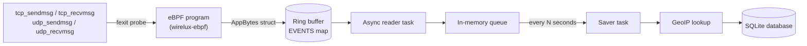

<div align="center">

# wirelux

**A lightweight, per-process network traffic monitor for Linux, built on eBPF `fexit` probes.**

[](LICENSE)
[](https://www.rust-lang.org/)
[](#kernel-compatibility)
[](#kernel-compatibility)

</div>

---

`wirelux` instruments kernel network sending and receiving for IPv4 TCP/UDP traffic and saves the collected events to SQLite. It reports how much data each process **actually** transmits and receives — not what it attempted to send — using kernel function-exit (`fexit`) probes instead of kprobes for just to support the feature of recording the remote address

Inspired by [GlassWire](https://www.glasswire.com/) (Windows), built for Linux.

## Table of contents

- [What wirelux does](#what-wirelux-does)
- [Features](#features)
- [Architecture](#architecture)
- [Data schema](#data-schema)
- [Kernel compatibility](#kernel-compatibility)
- [Prerequisites](#prerequisites)
- [Build and run](#build-and-run)
- [Configuration](#configtoml)
- [GeoIP lookup](#geoip-lookup)
- [**GUI — Wirelux Dashboard**](#gui--wirelux-dashboard)
- [Tuning](#tuning)
- [Limitations](#limitations)
- [What this project is (and isn't) for](#what-this-project-is-and-isnt-for)
- [Roadmap](#roadmap)
- [Troubleshooting](#troubleshooting)
- [License](#license)

## What wirelux does

`wirelux` attaches to the kernel exit points of four functions, covering both directions of IPv4 TCP and UDP traffic:

| Function      | Traffic       |
| ------------- | ------------- |
| `tcp_sendmsg` | TCP, outbound |
| `tcp_recvmsg` | TCP, inbound  |
| `udp_sendmsg` | UDP, outbound |
| `udp_recvmsg` | UDP, inbound  |

For every call, it records the actual byte count, the remote IPv4 address, the local port, the owning PID, the protocol, and the process's command name. (Technically its the executing thread). A background task batches these events and flushes them to a local SQLite database on a fixed interval.

## Features

- **Actual bytes, not attempted bytes.** Reads each function's return value, not the requested size — so a short write or a failed call doesn't get logged as a full-size success.
- **Per-process attribution.** Every event is tied to a PID and a process name.
- **Remote IP + local port capture.** Read directly off the kernel's socket structure at exit time.
- **SQLite persistence.** WAL-mode, indexed by timestamp, remote address, and PID. WAL used so that the DB doesnt become corrupted during sudden abort, only recent packets are at risk.
- **Low overhead.** Built on `fexit`/BTF trampolines rather than kprobe/kretprobe
- **GeoIP country lookup** for remote addresses.
- **Configurable** ring buffer size and save interval.
- **GUI** provides a map of all the connected countries

## Architecture



The eBPF side (`wirelux-ebpf`) does the minimum work possible inside the kernel: read the socket and return-value fields, and push a fixed-size record onto a ring buffer. Everything else — batching, GeoIP resolution, and disk persistence — happens in userspace (`wirelux`), off the hot path.

## Data schema

Events are appended to a table named `events`:

| Column         | Type      | Description                                            |
| -------------- | --------- | ------------------------------------------------------ |
| `id`           | `INTEGER` | Autoincrementing primary key                           |
| `timestamp_ns` | `INTEGER` | Kernel timestamp of the event, in nanoseconds          |
| `size`         | `INTEGER` | Actual bytes sent or received                          |
| `remote_addr`  | `TEXT`    | Remote IPv4 address, dotted-quad                       |
| `pid`          | `INTEGER` | Process ID                                             |
| `local_port`   | `INTEGER` | Local port                                             |
| `direction`    | `INTEGER` | `0` = received, `1` = sent                             |
| `protocol`     | `INTEGER` | `6` = TCP, `17` = UDP (IANA protocol numbers)          |
| `comms`        | `TEXT`    | Process command name                                   |
| `country`      | `TEXT`    | Remote address's country, if GeoIP lookup is available |

The database file is created automatically if it doesn't already exist.

## Kernel compatibility

`wirelux` is built around BTF-based `fexit` attachment, which has real, non-negotiable kernel requirements — this isn't a "should work everywhere" tool.

| Requirement         | Detail                                                           |
| ------------------- | ---------------------------------------------------------------- |
| Kernel              | 5.11+ on x86_64, 6.0+ on ARM                                     |
| BTF                 | `/sys/kernel/btf/vmlinux` must exist (`CONFIG_DEBUG_INFO_BTF=y`) |
| Tested architecture | x86_64 only — ARM is unverified                                  |
| OS                  | Linux only                                                       |

If `/sys/kernel/btf/vmlinux` doesn't exist on your system, `wirelux` cannot run — there is no fallback path.

## Prerequisites

1. **Install Rust.**
   - Recommended: `rustup toolchain install stable`
   - If you hit BPF build issues: `rustup toolchain install nightly`
2. **Install `bpf-linker`.**
   - `cargo install bpf-linker`
   - On macOS, install LLVM first, then: `cargo install bpf-linker --no-default-features`
3. **Cross-compiling from macOS or another host?**
   - `rustup target add ${ARCH}-unknown-linux-musl`
   - For Apple Silicon/Intel macOS, use `rust-lld` or another cross linker.

## Build and run

From `wirelux/wirelux`:

```bash
cargo build --package wirelux --release
cargo run --package wirelux --release
```

This build path automatically compiles the eBPF object and embeds it into the binary.

### Run with a custom database path

```bash
cargo run --package wirelux --release -- --out /tmp/wirelux_log.db
```

The custom path is persisted to `config.toml`.

### Optional build helper

An `xtask` helper builds only the eBPF crate:

```bash
cargo run -p xtask -- build-ebpf --release
```

Force a nightly build for the eBPF target if needed:

```bash
cargo +nightly run -p xtask -- build-ebpf --release
```

## `config.toml`

`wirelux` reads a simple one-line configuration file at `./config.toml`. The first non-empty line is the SQLite database path.

- Missing `config.toml` → created automatically.
- Empty `config.toml` → defaults to `./wirelux_log.db`.
- `config.toml` with a path → that path is used.

```text
./wirelux_log.db
```

## GeoIP lookup

`wirelux` looks for a GeoIP database at `../geolite_lookup/geolite.bin`, relative to the `wirelux` crate directory.

- **Present and loads successfully** → remote IPs are resolved to country names in the `country` column.
- **Missing** → events still save normally;

---

## GUI — Wirelux Dashboard

Wirelux ships a local web-based NOC dashboard that reads directly from the SQLite database recorded by the eBPF collector. It runs entirely on your machine — no cloud, no telemetry.

### What the GUI provides

| Feature | Detail |
|---|---|
| World map | Offline Natural Earth projection (D3 + world-atlas). Scroll to zoom, drag to pan, double-click to recenter. |
| Connection arcs | Animated curved arcs from your origin country to every destination country in the database. |
| Country nodes | Glowing pulsing dots at each country that has recorded traffic. |
| Connection tooltip | Hover any arc to see total bytes, incoming/outgoing split, packet count, unique processes, top process, timestamps, and protocols. |
| Process panel | Per-process bandwidth bars, automatically sized to fit the panel. Processes that don't fit are aggregated into an "Other Processes" row. |
| Filters | Direction (Incoming / Outgoing / Both), Protocol (TCP / UDP / All), Time range (10 min → All Time), Process search, Country search. All filters apply as SQL `WHERE` clauses server-side — no client-side filtering. |
| Auto-refresh | Data refreshes every 5 seconds automatically. |

### GUI prerequisites

The GUI requires **Node.js v18 or later**. Install it with your package manager or via [nvm](https://github.com/nvm-sh/nvm):

```bash
# Recommended — using nvm
curl -o- https://raw.githubusercontent.com/nvm-sh/nvm/v0.39.7/install.sh | bash
nvm install --lts

# Or via apt (Ubuntu/Debian)
sudo apt install nodejs npm

# Verify
node --version   # must be v18+
npm --version
```

No other system dependencies are required. The GUI does **not** need Electron, a backend server, or any cloud service.

### Install GUI dependencies (first time only)

```bash
cd GUI
npm install
npm approve-scripts better-sqlite3
npm approve-scripts esbuild
```

> `better-sqlite3` is a native SQLite binding compiled against your local Node version.
> The `approve-scripts` step runs its build — this only needs to be done once.
> If you upgrade Node.js later, re-run `npm install` inside `GUI/` to rebuild the binding.

### Open the GUI

Make sure the `wirelux` collector is running (or has previously run and populated the database), then:

```bash
cd GUI
npm run dev
```

This starts a local development server. Open your browser to:

```
http://localhost:5173
```

The dashboard loads automatically. It reads the database path from `../wirelux/config.toml` — no manual configuration needed.

### Close the GUI

Press **Ctrl + C** in the terminal where `npm run dev` is running. This stops the local server. Your browser tab will lose connection; simply close it.

The database and all collected data are unaffected — the GUI is read-only.

### Troubleshooting the GUI

| Symptom | Likely cause | Fix |
|---|---|---|
| `better-sqlite3` failed to compile | Node version mismatch or missing build tools | Run `npm install` again; ensure `gcc` / `g++` / `python3` are installed (`sudo apt install build-essential`) |
| Map doesn't appear | `world-atlas` asset not found | Run `npm install` from `GUI/` to ensure `node_modules/world-atlas/` is populated |
| "0 countries" shown | Database has no `country` data | Ensure `geolite.bin` is present and `wirelux` has been running long enough to capture traffic |
| Port 5173 already in use | Another process is using the port | Either stop that process, or edit `GUI/vite.config.js` and change `port: 5173` to another value |

---


## Tuning

### Ring buffer size

`wirelux/wirelux-ebpf/src/main.rs`:

```rust
const RING_BUF_SIZE: u32 = 1024 * 1024 * 4; // 4 MiB
```

### Save interval

`wirelux/wirelux/src/main.rs`:

```rust
const SAVE_INTERVAL_SECS: u64 = 30;
```

Rebuild after changing either.

## Limitations

- **x86_64 only, verified.** ARM is not tested by this repository.
- **IPv4 only.** The event data format uses `u32` addresses. IPv6 gets dropped completely.
- **Assumes a specific `sock_common` layout** and kernel BTF metadata; unsupported or unusual kernels may fail verifier checks or yield invalid data.
- **No per-interface uniqueness** — traffic can't be distinguished by network interface. 
- **Dropped packets are invisible by design**, to avoid destabilizing the eBPF program. (Very delicate)
- **UDP truncation:** if a UDP receive buffer is smaller than the incoming datagram, the recorded size is the datagram's full length, not the bytes actually copied into the buffer.
- **Process name accuracy is approximate.** It reads `/proc/<pid>/comm` and falls back to the kernel-captured `comm` value; both can be stale or wrong if a PID is reused quickly. To reduce risk of wrong process name captured, reduce SAVE_INTERVAL_SECS

## What this project is (and isn't) for

| Helps with                                                       | Doesn't help with                                                   |
| ---------------------------------------------------------------- | ------------------------------------------------------------------- |
| Spotting a process sending an unreasonable amount of data        | Malware injected into a legitimate, low-traffic process             |
| Noticing traffic to destinations that shouldn't be receiving any | Anything that doesn't show up as elevated or unusual network volume |

This is a visibility tool, not an intrusion-detection or anti-malware system.

## Roadmap

- [x] Country lookup for remote IPs
- [ ] Run At Startup (Top Priority)
- [ ] YARA rule integration for malware scanning
- [ ] Total bytes sent, reported per network interface
- [ ] IPv6 support
- [ ] Include local IP addresses in events

## Troubleshooting

| Error                           | Likely cause                                                                                                                 | Fix                                                                                                                                                                                            |
| ------------------------------- | ---------------------------------------------------------------------------------------------------------------------------- | ---------------------------------------------------------------------------------------------------------------------------------------------------------------------------------------------- |
| `Failed to load EBPF object.`   | `target/bpfel-unknown-none/release/wirelux-ebpf` doesn't exist, or `bpf-linker` isn't installed                              | Build the eBPF crate first (`cargo run -p xtask -- build-ebpf --release`); confirm `bpf-linker` is on your `PATH`                                                                              |
| `Failed to load BTF from sysfs` | `/sys/kernel/btf/vmlinux` is missing                                                                                         | Install a kernel debug/BTF package, or boot a kernel that exposes BTF                                                                                                                          |
| `BPF verifier rejected it`      | Kernel doesn't support the required `fexit` attachments, or its socket struct layout doesn't match what this project assumes | Check kernel version against [Kernel compatibility](#kernel-compatibility); see the project's fentry/fexit migration notes for how to verify function signatures against your own kernel's BTF |

## License

Distributed under the [GNU Affero General Public License, version 3](LICENSE).

Unless you explicitly state otherwise, any contribution intentionally submitted for inclusion in this project is licensed under the same terms.
